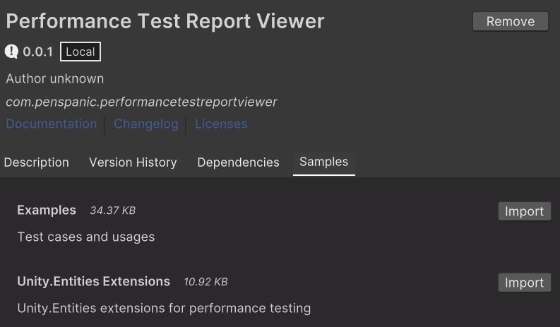

## Performance Test Report Viewer
This tool extends Unity's performance testing API to run various types of tests and visualize them in charts.

When you create multiple tests and want to compare the results, this tool will help you to compare the results of the tests in a chart.


| Compare tests                             | Parameterized tests                          |
|-------------------------------------------|----------------------------------------------|
|  |  |


## Prerequisites
API Compatibility Level : .Net Framework  
Unity Version : 2022.3.14f1
Performance testing API : 3.0.3

## Installiation
`Unity>Package Manager>Add package from git URL...`
- `https://github.com/penspanic/UnityPerformanceTestReportViewer.git`  

or  

`git clone https://github.com/penspanic/UnityPerformanceTestReportViewer.git`  
`Unity>Package Manager>Add package from disk...>path_to_UnityPerformanceTestReportViewer`

## Usage
### Write tests
Sample test codes are available in Package Samples.  

<br>

#### Simple test
```csharp
[SampleDefinitionContainer]
    public static class SimpleTestDefinitions
    {
        public const string Category = "SimpleTest";
        public static readonly ISampleDefinition Value1 = new DefaultSampleDefinition("Value1", Category, SampleUnit.Byte);
        public static readonly ISampleDefinition Value2 = new DefaultSampleDefinition("Value2", Category, SampleUnit.Byte);
        public static readonly ISampleDefinition Value3 = new DefaultSampleDefinition("Value3", Category, SampleUnit.Byte);
    }

    public class SimpleTest
    {
        [Test, Performance]
        public void Test()
        {
            using var sampleGroups = new SampleGroups();
            using (sampleGroups.CreateScope(SimpleTestDefinitions.Value1))
                Console.WriteLine("Do something");

            using (sampleGroups.CreateScope(SimpleTestDefinitions.Value2))
                Console.WriteLine("Do something");

            using (sampleGroups.CreateScope(SimpleTestDefinitions.Value3))
                Console.WriteLine("Do something");
        }
    }
```

#### Grouped test
You can visualize the results of multiple tests in a single chart.

##### Parameterized test
```csharp
public class ParameterizedTest
{
    [Test, Performance]
    public void Test([Values(1, 2, 3, 4, 5)]int parameter)
    {
        using var sampleGroups = new SampleGroups();
        using (sampleGroups.CreateScope(SimpleTestDefinitions.Value1))
            Console.WriteLine("Do something");
    }
}
```

##### Comparable test
```csharp
[ComparableTest]
public class GroupedTest
{
    [Test, Performance]
    public void Test1()
    {
        using var sampleGroups = new SampleGroups();
        using (sampleGroups.CreateScope(SimpleTestDefinitions.Value1))
            Console.WriteLine("Do something");
    }

    [Test, Performance]
    public void Test2()
    {
        using var sampleGroups = new SampleGroups();
        using (sampleGroups.CreateScope(SimpleTestDefinitions.Value1))
            Console.WriteLine("Do something");
    }

    [Test, Performance]
    public void Test3()
    {
        using var sampleGroups = new SampleGroups();
        using (sampleGroups.CreateScope(SimpleTestDefinitions.Value1))
            Console.WriteLine("Do something");
    }
}
```

### Run tests
Written tests will be displayed in the Unity Test Runner window. Run the tests.

### View results
Open PerformanceTestReportViewer window.  
(Window/Analysis/Performance Test Report Viewer, Ctrl+Shift+Alt+V)

Some viewing options are available in the window.  


## Extensions
### Unity.Entities Extension
Provides an extension for testing Unity.Entities. In particular, it provides performance testing extensions for ECS World.  
`Package Manager>Performance Test ReportViewer>Samples>Unity.Entities Extensions`  


